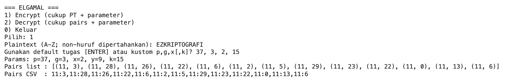
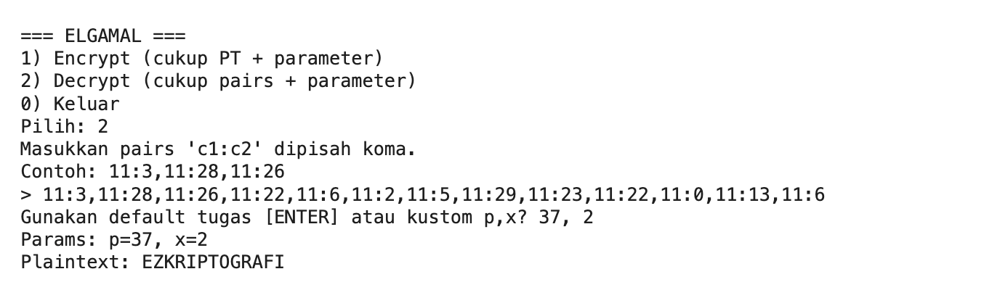

# Praktikum Kriptografi — ElGamal (per huruf A–Z)
**Nama:** Nikita Putri Prabowo  
**NPM:** 140810230010  
**Mata Kuliah:** Praktikum Kriptografi

## Ringkas Fitur
- Enkripsi & dekripsi **ElGamal** per huruf (A–Z → 0..25).
- Karakter non-huruf **dipertahankan** dengan penanda `(-1, ord(char))`.
- Input/Output enkripsi berupa **daftar pasangan (C1, C2)** dan format **CSV** `c1:c2,c1:c2,...`.
- Dapat pakai **parameter default tugas** (`p=37, g=3, x=2, k=15`) atau kustom; `k` bisa acak.

## Alur Program (Singkat)
- `main()` menampilkan menu:
  - **1. Encrypt**  
    - Input plaintext.  
    - Pilih default atau kustom `p,g,x[,k]`.  
    - Hitung `y = g^x mod p`.  
    - Pilih `k` (pakai input atau acak).  
    - Hitung **sekali**: `C1 = g^k mod p`, `s = y^k mod p`.  
    - Untuk tiap huruf: `m ∈ {0..25}`, hasilkan `(C1, C2 = m·s mod p)`.  
    - Non-huruf → `(-1, ord(ch))`.  
    - Cetak **Pairs list** dan **Pairs CSV**.
  - **2. Decrypt**  
    - Input **pairs** (format CSV).  
    - Pilih default atau kustom `p,x`.  
    - Untuk `(C1, C2)`: jika `C1 == -1` → pulihkan `chr(C2)`;  
      else `s = C1^x mod p`, `m = C2 · s^{-1} mod p (mod p)` → huruf `A+ m`.  
    - Cetak plaintext.
  - **0. Keluar**.

## Struktur Singkat Fungsi
- `ch2n / n2ch`: konversi huruf ↔ indeks 0..25.  
- `modinv`: invers modulo (EA diperluas).  
- `EGPub/EGPriv`: data parameter publik & privat.  
- `elgamal_encrypt_text`: kembalikan list `(C1,C2)` per karakter.  
- `elgamal_decrypt_pairs`: kembalikan plaintext dari pairs.  
- `parse_pairs`: baca string CSV `c1:c2,...` → list tuple.

## Catatan
- Jika `k` tidak diisi pada enkripsi kustom → dibuat **acak** (`secrets`).
- **Non-huruf tidak diubah** dan tidak memerlukan parameter kripto.

## Enkripsi

  

## Dekripsi

  