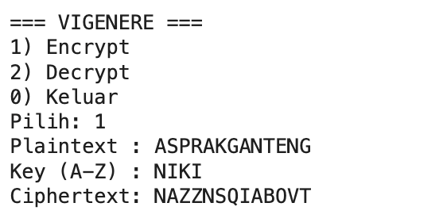
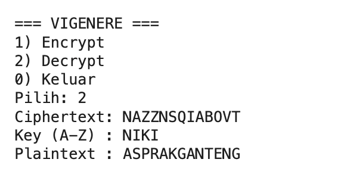

# Praktikum Kriptografi — Vigenère Cipher
**Nama:** Nikita Putri Prabowo  
**NPM:** 140810230010  
**Mata Kuliah:** Praktikum Kriptografi

## Alur Program 
- Program mulai di `main()` → tampilkan menu (Encrypt/Decrypt/Keluar).
- **Encrypt (1):** input plaintext & key → `clean_key` menyaring huruf A–Z → tiap huruf digeser sesuai kunci `(n + k) mod 26` → cetak ciphertext.  
  (Karakter non-huruf disalin apa adanya; indeks kunci hanya maju pada huruf.)
- **Decrypt (2):** input ciphertext & key → `(n - k) mod 26` → cetak plaintext.  
  (Aturan non-huruf & kemajuan kunci sama seperti enkripsi.)
- **Keluar (0):** hentikan program.
- Error (mis. key kosong) ditangani `try/except` dan ditampilkan sebagai `"Error: ..."`.

## Enkripsi

  

## Dekripsi

  